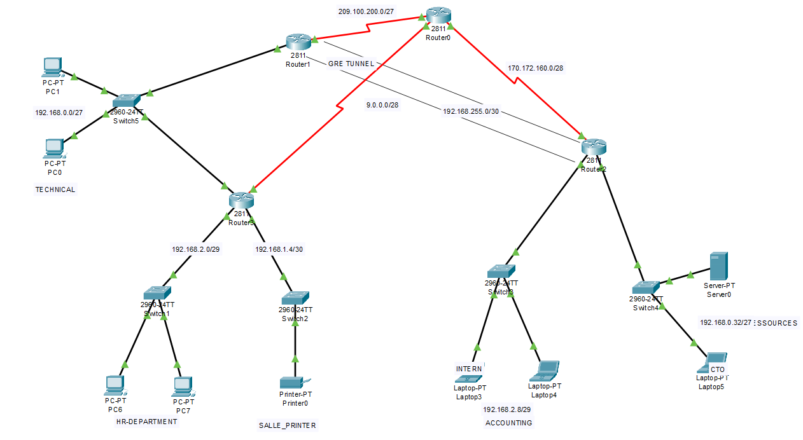
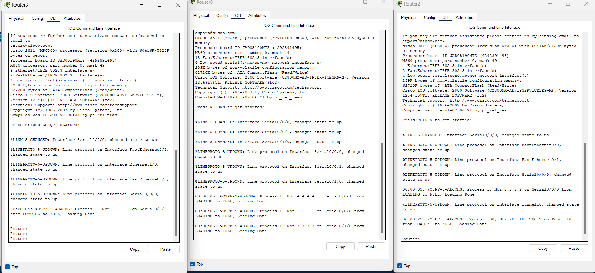
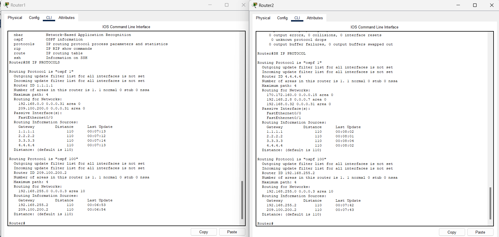
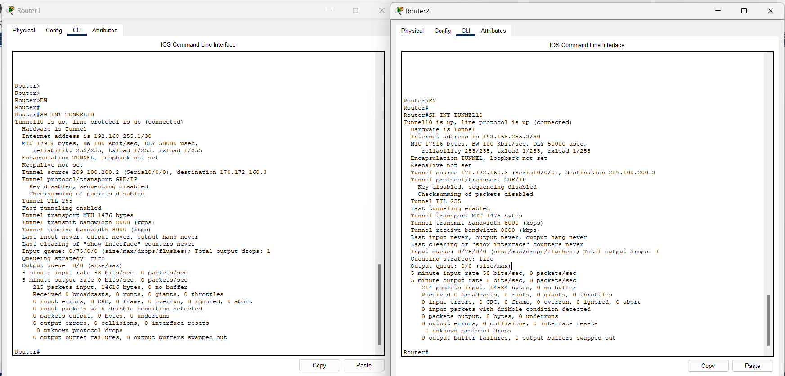
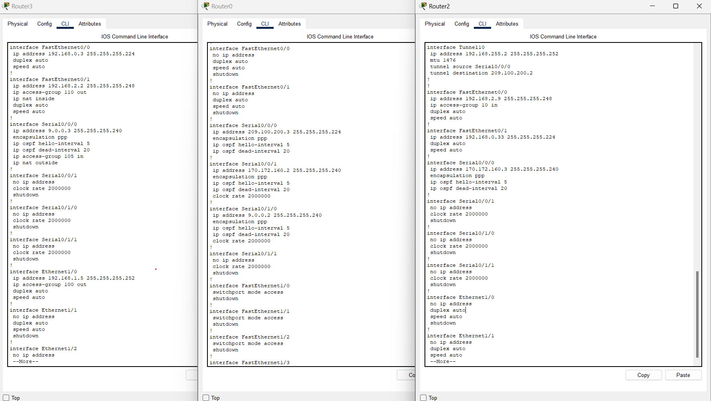
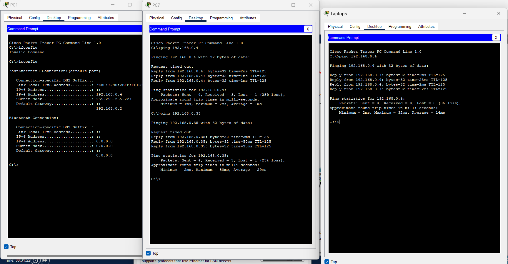

# 🌐 IP-GROUP — Configuration Réseau d'Entreprise (OSPF | NAT | PPP | VPN GRE | ACL)

Projet réalisé sous **Cisco Packet Tracer** dans le cadre de la configuration et de la supervision de l'infrastructure réseau de l'entreprise **IP-GROUP**. Ce lab couvre le routage dynamique OSPF multi-zones, la translation d'adresses (NAT/PAT), l'authentification PPP sur les liaisons WAN, un tunnel VPN GRE, ainsi qu'une politique de sécurité basée sur des ACLs.

📁 Fichier Packet Tracer : [`OSPF-NAT-PPP-VPN.pkt`](./OSPF-NAT-PPP-VPN.pkt)

---

## 🗺️ Topologie du réseau

Le réseau est composé de 3 sites (Router0, Router1, Router2/ISP) interconnectés, avec un routeur central Router3 desservant les départements internes.

| Département      | Sous-réseau         | Équipements               |
|-------------------|----------------------|----------------------------|
| TECHNICAL         | 192.168.0.0/27        | PC0, PC1                  |
| HR-DEPARTMENT      | 192.168.2.0/29        | PC6, PC7                  |
| SALLE_PRINTER      | 192.168.1.4/30        | Printer0                  |
| ACCOUNTING         | 192.168.2.8/29        | Laptop3 (INTERN), Laptop4 |
| RESOURCES          | 192.168.0.32/27       | Server0, Laptop5 (CTO)    |

**Liaisons WAN :**
- Router1 ↔ Router0 : `209.100.200.0/27`
- Router0 ↔ Router2 : `170.172.160.0/28`
- Router1 ↔ Router3 : `9.0.0.0/28`
- Tunnel GRE Router1 ↔ Router2 : `192.168.255.0/30`

> Router0 joue le rôle de routeur **ISP** intermédiaire entre Router1 et Router2.

---

## ⚙️ Réalisations techniques

### 1️⃣ Configuration de base
- Adressage IP complet de toutes les interfaces (LAN & WAN).
- Configuration des switches et connectivité de bout en bout vérifiée par `ping`.

### 2️⃣ Routage dynamique OSPF
- OSPF activé sur tous les routeurs, avec **Router-ID manuel** correspondant au numéro du routeur (ex : Router4 → `4.4.4.4`).
- **Interfaces LAN passives** sur tous les routeurs (pas d'annonces OSPF inutiles vers les hôtes).
- **Timers OSPF personnalisés** : `hello-interval 5` / `dead-interval 20` sur toutes les interfaces participant à OSPF.
- Deux processus OSPF distincts : **Process 1** (routage interne) et **Process 100** (tunnel VPN, Area 10).

### 3️⃣ Sécurité (ACLs)
- 🚫 **Laptop3 "INTERN"** (Accounting) : accès bloqué au serveur et au reste du réseau.
- 🖨️ **SALLE_PRINTER** : accessible uniquement depuis le **HR-DEPARTMENT**.
- 🔐 **Laptop5 "CTO"** : seul autorisé à établir une connexion distante sécurisée (SSH) vers le routeur du département TECHNICAL (Router3) ; le reste du trafic reste autorisé.
- 🚫 **PC0 (TECHNICAL)** : ping bloqué vers `192.168.2.0/29`, mais communication autorisée avec le reste du réseau.
- 🚫 **PC1 (TECHNICAL)** : ping bloqué vers Laptop5 "CTO" uniquement, reste du réseau accessible.

### 4️⃣ NAT / PAT
- **Router0** : NAT translatant le trafic du **HR-DEPARTMENT** vers l'adresse de son interface WAN série (overload).
- **Router2** : passerelle par défaut du **TECHNICAL**, avec **PAT** translatant leur trafic vers l'interface WAN de Router2.

### 5️⃣ Liaisons WAN — PPP & PAP
- Encapsulation **PPP** avec authentification **PAP** configurée sur les 3 liaisons :
  - Router2 ↔ Router0 (ISP)
  - Router0 ↔ Router1 (ISP)
  - Router1 ↔ Router3

### 6️⃣ VPN — Tunnel GRE
- Tunnel **GRE** établi entre Router1 (`209.100.200.2`) et Router2 (`170.172.160.3`) via le réseau `192.168.255.0/30`.
- Adjacence **OSPF Process 100 (Area 10)** formée avec succès sur l'interface Tunnel0 (confirmé par `%OSPF-5-ADJCHG ... FULL`).

---

## ✅ Tests & validations

**Topologie complète du réseau**


**Formation des adjacences OSPF au démarrage** — `%OSPF-5-ADJCHG` FULL sur toutes les liaisons Serial


**Vérification des processus OSPF** (`show ip protocols`) — Process 1 (interne, Router-ID manuel) et Process 100 (tunnel VPN, Area 10)


**État de l'interface Tunnel0** (`show int Tunnel0`) — GRE/IP up/up entre Router1 et Router2


**Configuration des interfaces** (`running-config`) — adressage, OSPF timers, ACLs, NAT appliqués


**Tests de connectivité** (`ping`) depuis PC1, PC7 et Laptop5 — validation de la connectivité et des ACLs


---

## 🛠️ Technologies & protocoles utilisés

`Cisco IOS` `OSPF (multi-area, multi-process)` `NAT/PAT` `PPP` `PAP` `GRE VPN Tunnel` `Extended & Standard ACLs` `Static Routing` `Cisco Packet Tracer`

---

## 📂 Structure du dépôt

```
├── OSPF-NAT-PPP-VPN.pkt              # Fichier de topologie Packet Tracer
├── network-topology.png              # Topologie complète du réseau
├── ospf-adjacency-boot.png           # Adjacences OSPF au démarrage
├── ospf-protocols-process1-100.png   # show ip protocols (Process 1 & 100)
├── tunnel0-gre-status.png            # show int Tunnel0 (VPN GRE)
├── running-config-interfaces.png     # Configuration des interfaces
├── ping-tests-connectivity.png       # Tests de ping/connectivité
└── README.md
```

---

## ▶️ Comment tester ce lab

1. Ouvrir le fichier `OSPF-NAT-PPP-VPN.pkt` avec **Cisco Packet Tracer** (v8.x recommandé).
2. Consulter la configuration de chaque routeur via l'onglet **CLI**.
3. Lancer des tests de connectivité (`ping`, `tracert`) depuis les différents PC/Laptops pour valider les règles de sécurité.

---

## 👤 Auteur

**ALAYE Odilon Alabi Administrateur Système & Réseau**
Lab réalisé dans le cadre d'un exercice pratique de configuration réseau d'entreprise (routage, sécurité, NAT, VPN).

📌 N'hésitez pas à ⭐ ce dépôt si le projet vous a été utile !
