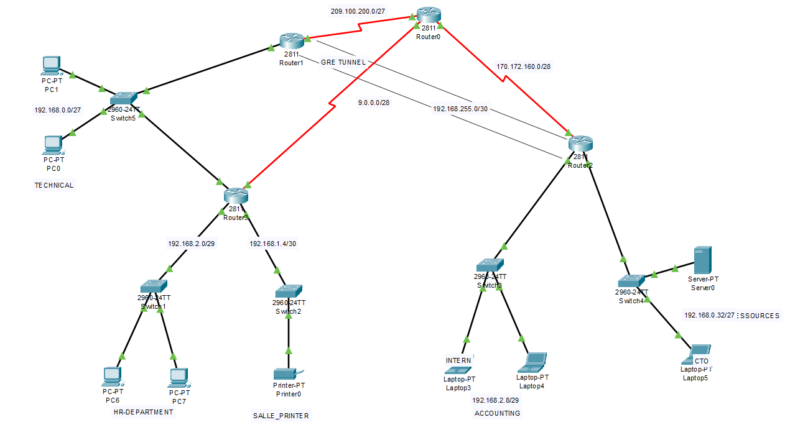
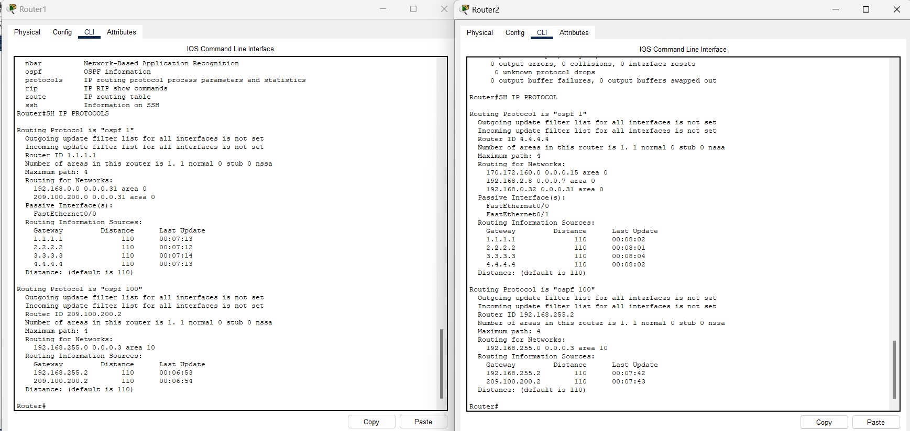
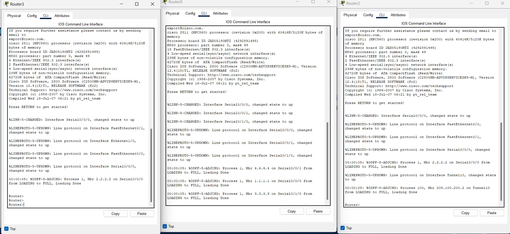
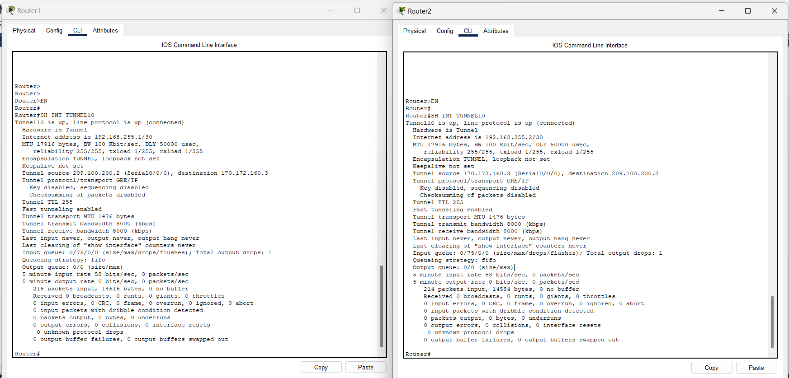
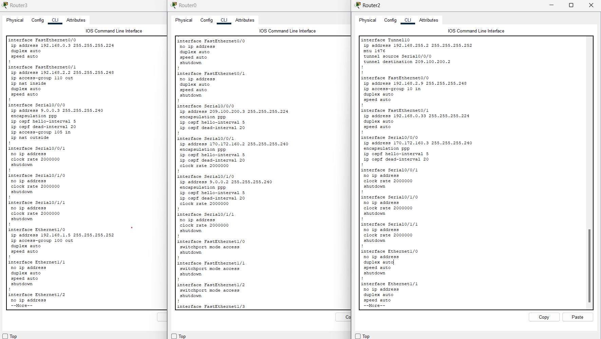
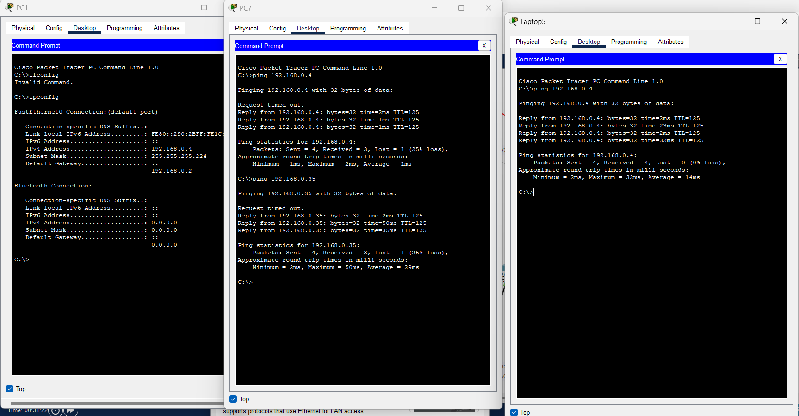

# 🌐 IP-GROUP — Infrastructure Réseau d'Entreprise Sécurisée


> Conception et sécurisation de l'infrastructure réseau complète de l'entreprise **IP-GROUP** : routage dynamique multi-zones, translation d'adresses, liaisons WAN authentifiées et tunnel VPN chiffré entre deux routeurs distants.

---

## 🎯 En bref

Ce projet met en œuvre une infrastructure réseau d'entreprise multi-sites de niveau avancé, combinant **routage dynamique OSPF à deux processus**, **NAT/PAT** pour l'accès Internet des départements internes, **authentification PPP/PAP** sur les liaisons WAN série, un **tunnel VPN GRE** reliant deux sites distants au travers d'un routeur ISP intermédiaire, et une politique de sécurité fine appliquée par ACL selon des règles métier différenciées par département.

**Compétences mises en œuvre :**
- Routage dynamique **OSPF multi-processus** (interne + tunnel VPN) avec Router-ID manuel et timers personnalisés
- **NAT/PAT (overload)** pour la sortie Internet de plusieurs départements via des interfaces WAN distinctes
- Sécurisation des liaisons WAN par **encapsulation PPP et authentification PAP**
- Mise en place d'un **tunnel VPN GRE** entre deux sites distants, avec adjacence OSPF formée à travers le tunnel
- Conception de **règles de sécurité métier** différenciées par utilisateur et par service, traduites en ACL étendues et standard
- Diagnostic réseau via `show ip protocols`, `show interface tunnel`, `show ip nat translations` et tests de connectivité ciblés

---

## 🗺️ Architecture



Le réseau est composé de **3 sites interconnectés** (Router0, Router1, Router2/ISP) avec un routeur central (Router3) desservant les départements internes. Router0 joue le rôle de **routeur ISP intermédiaire** entre Router1 et Router2.

### Plan d'adressage — Départements

| Département      | Sous-réseau         | Équipements               |
|-------------------|----------------------|----------------------------|
| TECHNICAL         | 192.168.0.0/27        | PC0, PC1                  |
| HR-DEPARTMENT      | 192.168.2.0/29        | PC6, PC7                  |
| SALLE_PRINTER      | 192.168.1.4/30        | Printer0                  |
| ACCOUNTING         | 192.168.2.8/29        | Laptop3 (INTERN), Laptop4 |
| RESOURCES          | 192.168.0.32/27       | Server0, Laptop5 (CTO)    |

### Liaisons WAN

| Liaison | Réseau |
|---|---|
| Router1 ↔ Router0 | 209.100.200.0/27 |
| Router0 ↔ Router2 | 170.172.160.0/28 |
| Router1 ↔ Router3 | 9.0.0.0/28 |
| Tunnel GRE Router1 ↔ Router2 | 192.168.255.0/30 |

---

## ⚙️ Réalisations techniques

### Routage dynamique OSPF multi-processus

OSPF est activé sur l'ensemble des routeurs avec un **Router-ID manuel** cohérent (ex : Router4 → `4.4.4.4`), des **interfaces LAN passives** pour éviter toute annonce inutile vers les hôtes, et des **timers personnalisés** (`hello-interval 5` / `dead-interval 20`) sur les liaisons participantes. Deux processus distincts cohabitent : le **Process 1** pour le routage interne, et le **Process 100** dédié au tunnel VPN (Area 10).



La formation des adjacences est confirmée dès le démarrage sur l'ensemble des liaisons série (`%OSPF-5-ADJCHG ... FULL`).



### Tunnel VPN GRE entre sites distants

Un tunnel **GRE** est établi entre Router1 (`209.100.200.2`) et Router2 (`170.172.160.3`) à travers le réseau `192.168.255.0/30`, avec une adjacence OSPF (Process 100, Area 10) formée avec succès directement sur l'interface `Tunnel0`.



### Sécurisation des liaisons WAN (PPP/PAP)

L'encapsulation **PPP** avec authentification **PAP** est configurée sur les trois liaisons série critiques du réseau (Router2 ↔ Router0, Router0 ↔ Router1, Router1 ↔ Router3), garantissant que seuls les équipements authentifiés peuvent établir la liaison WAN.

### NAT / PAT — Accès Internet des départements

**Router0** applique une translation NAT en *overload* pour le trafic du département HR vers son interface WAN série. **Router2**, passerelle par défaut du département TECHNICAL, applique une translation PAT équivalente vers sa propre interface WAN.

### Politique de sécurité par ACL — règles métier différenciées

| Règle | Portée |
|---|---|
| 🚫 Laptop3 "INTERN" (Accounting) | Accès bloqué au serveur et au reste du réseau |
| 🖨️ SALLE_PRINTER | Accessible uniquement depuis le département HR |
| 🔐 Laptop5 "CTO" | Seul autorisé à établir une connexion SSH vers Router3 (TECHNICAL) ; reste du trafic autorisé |
| 🚫 PC0 (TECHNICAL) | Ping bloqué vers 192.168.2.0/29, reste du réseau accessible |
| 🚫 PC1 (TECHNICAL) | Ping bloqué vers Laptop5 "CTO" uniquement, reste du réseau accessible |



---

## ✅ Validation

Les tests de connectivité (`ping`) réalisés depuis PC1, PC7 et Laptop5 confirment le comportement exact attendu par les règles métier : les flux autorisés passent normalement, les flux explicitement bloqués échouent comme prévu, validant l'ensemble de la politique de sécurité ACL en conditions réelles.



---

## 📥 Tester le projet

Le fichier de simulation Cisco Packet Tracer (`.pkt`) est disponible dans ce dépôt et prêt à être téléchargé directement :

**➡️ [Télécharger OSPF-NAT-PPP-VPN.pkt](https://github.com/Od45/dhcp-opsf-vpn-ppp-acl/raw/refs/heads/main/OSPF-NAT-PPP-VPN-ACL.pkt)**

---

## 🚀 Pistes d'évolution

- Ajouter l'authentification OSPF (MD5) sur les liaisons inter-routeurs pour sécuriser les échanges de routage.
- Chiffrer le tunnel GRE avec IPsec pour une confidentialité réelle des données transitant entre sites (GRE seul n'assure que l'encapsulation, pas le chiffrement).
- Documenter la table NAT (`show ip nat translations`) pour objectiver les traductions en cours.
- Ajouter une liaison WAN de secours pour éliminer le point de panne unique entre Router1 et Router2.

---

## 🛠️ Technologies & protocoles utilisés

`Cisco IOS` · `OSPF (multi-area, multi-process)` · `NAT/PAT` · `PPP` · `PAP` · `GRE VPN Tunnel` · `Extended & Standard ACLs` · `Static Routing` · `Cisco Packet Tracer`

---

## 📂 Structure du dépôt

```
├── README.md
├── OSPF-NAT-PPP-VPN.pkt              ← fichier de simulation à ouvrir dans Packet Tracer
├── network-topology.png
├── ospf-adjacency-boot.png
├── ospf-protocols-process1-100.png
├── tunnel0-gre-status.png
├── running-config-interfaces.png
└── ping-tests-connectivity.png
```

---

## 👤 Auteur

**ALAYE Odilon Alabi** — Administrateur Système & Réseau

N'hésite pas à me contacter pour toute question sur ce projet ou pour échanger sur des opportunités en administration réseau / infrastructure.
